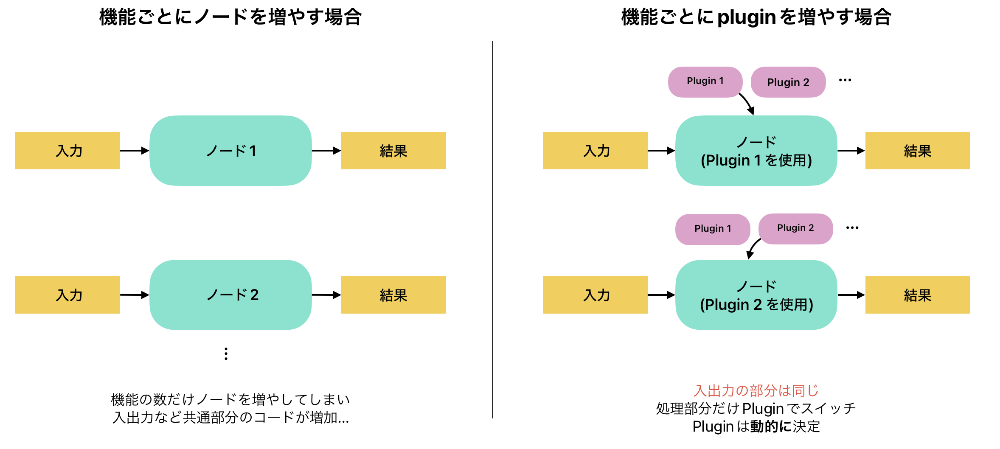

# PluginlibLecture

## 1. pluginlibとは
pluginlibは、ROS 2における1つのノードを拡張するための仕組みです。

画像を取得して特定の物体の二次元座標を出力するプログラムを書きたいと思ったとき、その方法はいくつかありますが、この機能の分岐方法には頭を悩ますことでしょう。

<br>

プログラムを触りたてであれば、単一のノード内でswitch分岐させるのが真っ先に挙がるかもしれません。

あるいは、別々のノードとして作成して入出力を同じようにするのもいいでしょう。

しかし、いずれも機能追加のたびにノード数を増やす必要があったり、依存関係が複雑になっていったりとメンテナンスが非常に大変になっていきます。

<br>

Pluginlibであれば、この問題を解決できるだけでなく、コンパイル時にその従属関係を明示する必要がありません。

また、ロード時は文字列を使用して指定します。そのため、ロード対象のライブラリをパラメータとして指定することも可能ということです。



<br>

## 解説

ここでは、CoRE-1（ロボコン）2024で使用される画像処理ノード `PanelDetector` を使用します。

<br>

[StrayedCats/PanelDetector](https://github.com/StrayedCats/PanelDetector)

このノードは現在開発中なので、もしかしたら変更が加わるかもしれません。


<br>

依存関係は以下のようになっています。


<br>

Pluginlibは実装の性質上、ゴールを先に解説していきます。

- 実装対象（ゴール）
- Pluginlibのベース
- Pluginlib

また、`CMakeLists.txt` や `package.xml` についてはいちいち説明はしません。詳しくは[PanelDetector](https://github.com/StrayedCats/PanelDetector)リポジトリをご覧ください。

<br>

### 実装対象（ゴール）

PanelDetectorの実装内容は `画像` の入力に対して `検出対象の2D位置の配列` を出力する非常にシンプルなものです。

<br>

Pluginlibで作成されたモジュールは `class_loader.createSharedInstance("プラグインの名前の文字列")` 関数で呼び出すことができます。

使用されるPluginは、呼び出されるメソッド・メンバに制約がありますが、ほとんど独立したライブラリとして本体のpub-subを意識することなく書くことができます。


<details><summary>panel_detector_node.hpp</summary>

```c++
#pragma once

#include <cv_bridge/cv_bridge.h>

// プラグインベースのヘッダファイル
#include <panel_detector_base/panel_detector_base.hpp>
// generate_parameter_libraryのヘッダファイル
#include <panel_detector_param/panel_detector_param.hpp>
// <pluginlib/class_list_macros.hpp> はPluginlibを使用するために必要です
#include <pluginlib/class_loader.hpp>

#include <rclcpp/rclcpp.hpp>
#include <sensor_msgs/msg/image.hpp>
#include <vision_msgs/msg/detection2_d_array.hpp>

namespace panel_detector_node
{
class PanelDetectorNode : public rclcpp::Node
{
public:
  PanelDetectorNode(const rclcpp::NodeOptions &);
  void image_callback(const sensor_msgs::msg::Image::SharedPtr msg);

private:
  // pub-subの設定
  rclcpp::Subscription<sensor_msgs::msg::Image>::SharedPtr image_sub_;
  rclcpp::Publisher<vision_msgs::msg::Detection2DArray>::SharedPtr pose_pub_;

  // panel_detector_base::Detector 型のClassloader
  pluginlib::ClassLoader<panel_detector_base::Detector> detection_loader_;
  // ClassloaderでロードされるDetectorのインスタンス（複数あっても良い）
  std::shared_ptr<panel_detector_base::Detector> detector_;

  // generate_parameter_libraryの関数なので割愛
  std::shared_ptr<panel_detector_parameters::ParamListener> param_listener_;
};
}
```
</details>

<details><summary>panel_detector_node.cpp</summary>

```c++
#include <panel_detector_node/panel_detector_node.hpp>

namespace panel_detector_node
{

PanelDetectorNode::PanelDetectorNode(const rclcpp::NodeOptions & options)
: rclcpp::Node("panel_detector_node", options),
  // detector_loader_の初期化はここで行う
  detection_loader_("panel_detector_base", "panel_detector_base::Detector")
{
  this->param_listener_ = std::make_shared<panel_detector_parameters::ParamListener>(
    this->get_node_parameters_interface());
  const auto params = this->param_listener_->get_params();

  // プラグインのロード
  try {
    this->detector_ = this->detection_loader_.createSharedInstance(
      params.load_target_plugin);
    // init関数の呼び出し（実装はpanel_detector_pluginsにあります）
    this->detector_->init(*this->param_listener_);
    std::cout << "params.load_target_plugin: " << params.load_target_plugin << std::endl;
  } catch (pluginlib::PluginlibException & ex) {
    // プラグインのロードに失敗した場合
    printf("The plugin failed to load for some reason. Error: %s\n", ex.what());
  }

  // pub-subの設定
  this->pose_pub_ = this->create_publisher<vision_msgs::msg::Detection2DArray>(
    "positions", 1);
  this->image_sub_ = this->create_subscription<sensor_msgs::msg::Image>(
    "image_raw", 1, std::bind(&PanelDetectorNode::image_callback, this, std::placeholders::_1));
}

// 画像のコールバック関数
void PanelDetectorNode::image_callback(const sensor_msgs::msg::Image::SharedPtr msg)
{
  // detect関数の呼び出し (実装はpanel_detector_pluginsにあります)
  vision_msgs::msg::Detection2DArray bboxes =
    this->detector_->detect(cv_bridge::toCvShare(msg, "bgr8")->image);
  for (size_t i = 0; i < bboxes.detections.size(); i++) {
    std::cout << "bboxes [" << i << "]: " << bboxes.detections[i].bbox.center.position.x << ", " <<
      bboxes.detections[i].bbox.center.position.y <<
      std::endl;
  }
  // 検出結果のPublish
  this->pose_pub_->publish(bboxes);
}
} // namespace panel_detector_node

// rclcpp_componentsの登録（今回のノードの説明には関係ないので割愛）
#include "rclcpp_components/register_node_macro.hpp"
RCLCPP_COMPONENTS_REGISTER_NODE(panel_detector_node::PanelDetectorNode)
```
</details>

<br>

### プラグインのベース

Pluginlibを使用するには、ベースとなるクラスを作成する必要があります。

このベースは、プラグイン・ノードどちらにも共有され、プラグインのロード時に呼び出される関数を定義します。プラグイン内では、これ以外にも関数を設定することはできますが、ノード上では呼び出すことができません。

関数はすべて純粋仮想関数（`virtual void func() = 0;`）である必要があります。

<details><summary>panel_detector_base.hpp</summary>

```c++
#pragma once

#include <panel_detector_param/panel_detector_param.hpp>
#include <vector>
#include <vision_msgs/msg/detection2_d_array.hpp>
#include <opencv2/opencv.hpp>

namespace panel_detector_base
{
class Detector
{
public:
  virtual void init(const panel_detector_parameters::ParamListener & param_listener) = 0;
  virtual vision_msgs::msg::Detection2DArray detect(const cv::Mat & image) = 0;
  virtual ~Detector() {}

protected:
  Detector() {}
};
}
```

</details>

<br>

### プラグイン（実装対象）

プラグインは、ベースクラスを継承して作成され、ノード上で動的にロードされます。

ここでは、 `PublishCenter` というプラグインを作成します。

このプラグインは、画像を受け取ると画像の中心を検出結果として返します。

<details><summary>publish_center.hpp</summary>

```c++
#pragma once

// プラグインベースのヘッダファイル
#include <panel_detector_base/panel_detector_base.hpp>

#include <panel_detector_param/panel_detector_param.hpp>
#include <vision_msgs/msg/detection2_d_array.hpp>

namespace panel_detector_plugins
{
typedef vision_msgs::msg::Detection2DArray Detection2DArray;
// panel_detector_base::Detectorを継承して新しくPublishCenterを作成
class PublishCenter : public panel_detector_base::Detector
{
public:
  // 内容はpanel_detector_base::Detectorの関数をオーバーライドしたもの。
  void init(const panel_detector_parameters::ParamListener &) override;
  Detection2DArray detect(const cv::Mat &) override;
};
}
```

</details>

<details><summary>publish_center.cpp</summary>

```c++
#include "panel_detector_plugins/publish_center.hpp"

namespace panel_detector_plugins
{

void PublishCenter::init(const panel_detector_parameters::ParamListener & param_listener)
{
  (void)param_listener;
}
Detection2DArray PublishCenter::detect(const cv::Mat & image)
{
  int col = image.cols;
  int row = image.rows;

  Detection2DArray pose;
  pose.detections.resize(1);
  pose.detections[0].bbox.center.position.x = col / 2;
  pose.detections[0].bbox.center.position.y = row / 2;
  return pose;
}
}

// Pluginlibの登録を行う
#include <pluginlib/class_list_macros.hpp>
PLUGINLIB_EXPORT_CLASS(panel_detector_plugins::PublishCenter, panel_detector_base::Detector)
```

</details>

<br>

Pluginlibを登録するためには、それを登録するためにxmlファイルを作成してCMake（`colcon build`）で登録する必要があります。

以下にそのxmlファイルを示します。

<details><summary>panel_detector_plugins.xml</summary>

```xml
<library path="panel_detector_plugins">
    <class type="panel_detector_plugins::PublishCenter" base_class_type="panel_detector_base::Detector">
        <description>publish image center example</description>
    </class>
</library>
```

</details>

<details><summary>panel_detector_plugins/CMakelists.txt</summary>

```cmake
cmake_minimum_required(VERSION 3.8)
project(panel_detector_plugins)

if(CMAKE_COMPILER_IS_GNUCXX OR CMAKE_CXX_COMPILER_ID MATCHES "Clang")
  add_compile_options(-Wall -Wextra -Wpedantic)
endif()

find_package(ament_cmake_auto REQUIRED)
ament_auto_find_build_dependencies()
find_package(OpenCV REQUIRED)

file(GLOB_RECURSE SRCS src/*.cpp)
ament_auto_add_library(panel_detector_plugins SHARED
  ${SRCS}
)
ament_target_dependencies(${PROJECT_NAME} OpenCV)

# Pluginの単体テスト
if(BUILD_TESTING)
  find_package(ament_lint_auto REQUIRED)
  set(ament_cmake_copyright_FOUND TRUE)
  set(ament_cmake_cpplint_FOUND TRUE)
  ament_lint_auto_find_test_dependencies()

  find_package(ament_cmake_gtest REQUIRED)
  find_package(ament_cmake_gmock REQUIRED)

  set(TEST_TARGETS
    test_publish_center)
  foreach(TARGET ${TEST_TARGETS})
    ament_add_gtest(${TARGET} test/src/${TARGET}.cpp)
    target_link_libraries(${TARGET} ${PROJECT_NAME} ${OpenCV_LIBRARIES})
  endforeach()
endif()

# Pluginlibの登録を行う
pluginlib_export_plugin_description_file(panel_detector_base panel_detector_plugins.xml)

include_directories(include)
ament_auto_package()
```

</details>

<br>

新しくPluginを一つ作成して登録したい場合は、 `panel_detector_plugins` にプラグインのc++ファイルを追加して、 `panel_detector_plugins.xml` にクラス名を追加するだけで登録が可能です。

また、Pluginの場所は `panel_detector_plugins` でなくても構いません。新しくpkgを作成した場合は、 `panel_detector_node.hpp` の `detection_loader_` の第一引数を変更することで、Pluginの場所を変更することができます。

ただし、ロードするPluginは `panel_detector_base::Detector` を継承している必要があります。

<br>